# Design Document: AI Portfolio Redesign

## Overview

This design transforms Dongik Min's (Douglas) existing Astro 5.0 portfolio into an AI-themed experience. The redesign layers AI-inspired visuals — neural network canvas animations, ambient particles, glowing gradient borders, and a typewriter effect — onto the existing static site architecture. It also adds an interactive AI chatbot widget, migrates the blog to `notion-astro-loader`, and introduces an image optimization pipeline using `sharp`.

The site retains its current Astro 5.0 static output, Notion-powered blog, light/dark theme toggle, CSS custom properties system, and AWS Amplify deployment. All new visual components are implemented as client-side canvas animations and CSS enhancements that layer on top of the existing component structure.

### Key Design Decisions

1. **Canvas-based animations over CSS/SVG**: The neural network background and particle system use HTML Canvas for smooth 60fps rendering with fine-grained control over node positions, connections, and particle physics. CSS animations cannot achieve the dynamic node-proximity-based line drawing required.

2. **Client-side chatbot with API proxy**: The chatbot sends messages to a server-side API endpoint (Astro API route or external function) to avoid exposing API keys in the browser. Falls back to static FAQ mode when no API key is configured.

3. **notion-astro-loader for blog migration**: Replaces the custom `src/lib/notion.ts` with Astro's native content layer integration, gaining built-in caching (digest-based), automatic schema inference, and rehype-based HTML rendering.

4. **sharp for image optimization**: The `sharp` library handles image downloading, resizing (720px max width), and WebP conversion in a pre-build script, with hash-based caching to skip unchanged images.

5. **CSS custom properties for theming**: All AI gradient colors are defined as CSS custom properties, enabling the theme toggle to switch between dark mode (full glow effects) and light mode (subtle shadows) without JavaScript recalculation.

## Architecture

```mermaid
graph TB
    subgraph "Build Pipeline"
        A[npm run deploy] --> B[sync-notion-images.ts]
        B --> C[Download & Optimize Images via sharp]
        C --> D[astro build]
        D --> E[deploy-amplify.sh]
    end

    subgraph "Content Layer"
        F[Notion Database] --> G[notion-astro-loader]
        G --> H[Blog Collection]
        I[Markdown Files] --> J[glob loader]
        J --> K[Projects Collection]
        J --> L[Experience Collection]
    end

    subgraph "Layout Layer"
        M[BaseLayout.astro] --> N[Navigation.astro]
        M --> O[ParticleBackground.astro]
        M --> P[ChatbotWidget.astro]
        M --> Q[Footer]
    end

    subgraph "Page Layer"
        R[index.astro] --> S[NeuralBackground.astro]
        R --> T[HeroSection.astro]
        R --> U[SkillCards.astro]
        R --> V[ProjectCards.astro]
        W[experience.astro] --> X[Timeline.astro]
        Y[blog/index.astro] --> H
        Z[blog/id.astro] --> H
    end

    subgraph "Client-Side Components"
        S --> S1[neural-network.ts - Canvas Animation]
        O --> O1[particles.ts - Canvas Animation]
        T --> T1[typewriter.ts - Text Animation]
        P --> P1[chatbot.ts - Chat Logic]
    end

    style S1 fill:#06b6d4,color:#fff
    style O1 fill:#3b82f6,color:#fff
    style T1 fill:#8b5cf6,color:#fff
    style P1 fill:#ec4899,color:#fff
```



### Component Hierarchy

```
BaseLayout.astro
├── Navigation.astro (updated: "Douglas.AI", AI gradient)
├── ParticleBackground.astro (NEW: ambient particles on all pages)
├── <slot /> (page content)
│   ├── index.astro
│   │   ├── NeuralBackground.astro (NEW: hero canvas)
│   │   ├── HeroSection.astro (UPDATED: typewriter, AI styling)
│   │   ├── SkillCards.astro (UPDATED: animated borders)
│   │   └── ProjectCards.astro (UPDATED: AI glow, badges)
│   ├── experience.astro
│   │   └── Timeline.astro (UPDATED: diamond markers, pulsing line)
│   ├── blog/index.astro (UPDATED: notion-astro-loader)
│   └── blog/[id].astro (UPDATED: notion-astro-loader render)
├── ChatbotWidget.astro (NEW: floating AI chatbot)
└── Footer
```

## Components and Interfaces

### 1. NeuralBackground Component

**File**: `src/components/NeuralBackground.astro` + `src/scripts/neural-network.ts`

Renders an HTML canvas in the hero section with animated nodes and proximity-based connecting lines.

```typescript
// src/scripts/neural-network.ts
interface NeuralNode {
  x: number;
  y: number;
  vx: number;       // velocity x (-0.5 to 0.5 px/frame)
  vy: number;       // velocity y (-0.5 to 0.5 px/frame)
  radius: number;   // 2-4px
  opacity: number;  // 0.3-0.8
}

interface NeuralNetworkConfig {
  canvas: HTMLCanvasElement;
  nodeCount: number;          // 30-60 desktop, ≤20 mobile
  connectionDistance: number;  // 150px
  isDarkMode: boolean;
  colors: {
    cyan: string;    // #06b6d4
    blue: string;    // #3b82f6
    purple: string;  // #8b5cf6
    magenta: string; // #ec4899
  };
}

function initNeuralNetwork(config: NeuralNetworkConfig): {
  start(): void;
  stop(): void;
  updateTheme(isDark: boolean): void;
  resize(): void;
};
```

**Behavior**:
- Nodes drift with random velocities, bouncing off canvas edges
- Lines drawn between nodes within 150px, opacity inversely proportional to distance
- Dark mode: nodes have glow effect (`shadowBlur: 10, shadowColor: rgba(6,182,212,0.6)`)
- Light mode: nodes at opacity 0.3, lines at opacity 0.1
- Targets 30fps via `requestAnimationFrame` with frame throttling
- Pauses when tab is hidden (`document.hidden`)
- Falls back to CSS gradient if Canvas API unavailable

### 2. ParticleBackground Component

**File**: `src/components/ParticleBackground.astro` + `src/scripts/particles.ts`

Fixed-position canvas rendering floating particles on all pages.

```typescript
// src/scripts/particles.ts
interface Particle {
  x: number;
  y: number;
  speed: number;   // 0.2-0.5 px/frame upward
  size: number;    // 1-3px
  opacity: number; // varies by theme
}

interface ParticleConfig {
  canvas: HTMLCanvasElement;
  particleCount: number;  // 15-30 desktop, ≤10 mobile
  isDarkMode: boolean;
}

function initParticles(config: ParticleConfig): {
  start(): void;
  stop(): void;
  updateTheme(isDark: boolean): void;
  resize(): void;
};
```

**Behavior**:
- Particles float upward, wrapping to bottom when they exit the top
- Dark mode: cyan particles at opacity 0.1-0.3
- Light mode: blue particles at opacity 0.05-0.15
- Canvas has `pointer-events: none` and `position: fixed`
- Pauses when tab is hidden

### 3. HeroSection Component (Updated)

**File**: `src/components/HeroSection.astro` + `src/scripts/typewriter.ts`

Replaces the laptop code editor widget with a typewriter effect cycling through AI phrases.

```typescript
// src/scripts/typewriter.ts
interface TypewriterConfig {
  element: HTMLElement;
  phrases: string[];       // ["Building with AI", "Full-Stack Developer", "Machine Learning Enthusiast"]
  typeSpeed: number;       // ms per character (50ms)
  deleteSpeed: number;     // ms per character (30ms)
  pauseDuration: number;   // ms between phrases (2000ms)
}

function initTypewriter(config: TypewriterConfig): {
  start(): void;
  stop(): void;
};
```

**Staggered animation**: Each hero element fades in 200ms after the previous using CSS `animation-delay`.

### 4. SkillCards Component (Updated)

**File**: `src/components/SkillCards.astro`

Adds animated gradient borders cycling through AI_Gradient colors over 3 seconds.

```css
/* Animated gradient border using @property for hue rotation */
@property --gradient-angle {
  syntax: "<angle>";
  initial-value: 0deg;
  inherits: false;
}

.skill-card {
  border: 2px solid transparent;
  background-origin: border-box;
  background-clip: padding-box, border-box;
  background-image:
    linear-gradient(var(--color-bg), var(--color-bg)),
    conic-gradient(from var(--gradient-angle), #06b6d4, #3b82f6, #8b5cf6, #ec4899, #06b6d4);
  animation: rotate-gradient 3s linear infinite;
}

@keyframes rotate-gradient {
  to { --gradient-angle: 360deg; }
}
```

**Hover**: Box-shadow spread increases from 1px to 4px glow.

### 5. ChatbotWidget Component

**File**: `src/components/ChatbotWidget.astro` + `src/scripts/chatbot.ts`

Floating chat widget with LLM integration and FAQ fallback.

```typescript
// src/scripts/chatbot.ts
interface ChatMessage {
  role: 'user' | 'assistant';
  content: string;
  timestamp: Date;
}

interface ChatbotConfig {
  apiEndpoint: string;       // /api/chat or external
  maxMessages: number;       // 10 (context window limit)
  timeoutMs: number;         // 10000
  greeting: string;
  faqMode: boolean;          // true when no API key
}

interface FAQEntry {
  patterns: string[];        // keyword patterns
  response: string;
}

function initChatbot(config: ChatbotConfig): {
  open(): void;
  close(): void;
  sendMessage(text: string): Promise<void>;
  getMessages(): ChatMessage[];
};
```

**Panel**: 380×500px, slides up from bottom-right. Styled with AI_Gradient border glow in dark mode.

**FAQ Mode**: When no API key is configured, the chatbot matches user input against predefined keyword patterns and returns static responses about skills, projects, and contact info.

**ARIA**: Floating button has `aria-label="AI 채팅 열기"`. Panel has `role="dialog"` and `aria-label="AI 어시스턴트 채팅"`.

### 6. ProjectCards Component (Updated)

**File**: Updates to existing project card styles in `src/pages/index.astro` and `src/pages/projects.astro`

- Dark mode hover: AI_Gradient glow border
- Tags: semi-transparent AI_Gradient background
- Viewport-triggered fade-up animation via `IntersectionObserver`
- "AI Project" badge with pulsing glow for cards tagged "AI" or "Machine Learning"

### 7. Timeline Component (Updated)

**File**: Updates to `src/pages/experience.astro` and `src/pages/about.astro`

- Timeline line: animated dashed line pulsing with AI_Gradient colors
- Markers: diamond-shaped (rotated square) with glow effect
- Hover: marker glow intensity increases

### 8. Navigation Component (Updated)

**File**: `src/components/Navigation.astro`

- Logo text: "Douglas.AI" with AI_Gradient text fill
- Dark mode: bottom border replaced with AI_Gradient glow
- Active link underline: AI_Gradient colors

### 9. Blog Migration (notion-astro-loader)

**File**: `src/content/config.ts` (updated blog collection)

```typescript
import { notionLoader } from 'notion-astro-loader';

const blog = defineCollection({
  loader: notionLoader({
    auth: import.meta.env.NOTION_TOKEN,
    database_id: import.meta.env.NOTION_DATABASE_ID,
    filter: {
      property: 'Published',
      checkbox: { equals: true },
    },
    sorts: [{ property: 'Published Date', direction: 'descending' }],
  }),
});
```

Blog pages use `entry.render()` for HTML output instead of manual `marked.parse()`. The loader handles callout blocks, toggle blocks, and code blocks natively via rehype. The custom `src/lib/notion.ts` is removed after migration.

URL structure preserved: `/blog` listing and `/blog/[id]` detail pages use `entry.id` (Notion page ID) as the slug.

### 10. Image Optimization Pipeline

**File**: `scripts/sync-notion-images.ts`

```typescript
interface ImageSyncConfig {
  notionToken: string;
  databaseId: string;
  outputDir: string;        // 'public/images/blog'
  maxWidth: number;          // 720
  format: 'webp';
  cacheFile: string;         // '.image-cache.json'
}

interface ImageCacheEntry {
  notionUrl: string;
  localPath: string;
  hash: string;              // MD5 of original image
  lastSynced: string;        // ISO date
}
```

**Process**:
1. Query Notion database for published posts
2. Extract all image URLs from page blocks
3. Check cache — skip if hash matches
4. Download, resize with `sharp` (720px max width, maintain aspect ratio), convert to WebP
5. Save to `public/images/blog/{pageId}/{filename}.webp`
6. Update cache file
7. During build, a remark/rehype plugin replaces Notion image URLs with local paths

### 11. Deploy Script (Updated)

**File**: `scripts/deploy-amplify.sh` (updated) + `scripts/sync-notion-images.ts` (new)

The `npm run deploy` command orchestrates: image sync → astro build → amplify deploy.

```json
{
  "scripts": {
    "sync:images": "tsx scripts/sync-notion-images.ts",
    "build": "npm run sync:images && astro check && astro build",
    "deploy": "bash ./scripts/deploy-amplify.sh"
  }
}
```

## Data Models

### CSS Custom Properties (AI Theme)

```css
:root {
  /* AI Gradient Colors */
  --color-ai-cyan: #06b6d4;
  --color-ai-blue: #3b82f6;
  --color-ai-purple: #8b5cf6;
  --color-ai-magenta: #ec4899;

  /* Updated accent */
  --color-accent: #06b6d4;

  /* Glow effects */
  --glow-sm: 0 0 10px rgba(6, 182, 212, 0.15);
  --glow-md: 0 0 20px rgba(6, 182, 212, 0.15);
  --glow-lg: 0 0 30px rgba(6, 182, 212, 0.25);
}

[data-theme="dark"] {
  --color-bg: #0a0a1a;  /* deeper dark for glow contrast */
  --color-accent: #06b6d4;
}
```

### Blog Collection Schema (after migration)

The `notion-astro-loader` auto-infers the schema from the Notion database. The expected properties map to:

| Notion Property | Type | Usage |
|---|---|---|
| Title | title | Post title |
| Description | rich_text | Post excerpt |
| Published | checkbox | Filter: only published posts |
| Published Date | date | Sort order, display date |
| Tags | multi_select | Post categorization |

### ChatMessage Model

```typescript
interface ChatMessage {
  role: 'user' | 'assistant';
  content: string;
  timestamp: Date;
}
```

Messages are stored in component state (not persisted). Limited to 10 most recent for API context.

### Image Cache Model

```typescript
// .image-cache.json
interface ImageCache {
  [notionUrl: string]: {
    localPath: string;
    hash: string;
    lastSynced: string;
  };
}
```

### FAQ Data Model

```typescript
interface FAQEntry {
  patterns: string[];   // e.g. ["기술", "스택", "skill", "tech"]
  response: string;     // Korean response text
}

const faqData: FAQEntry[] = [
  {
    patterns: ["기술", "스택", "skill", "tech", "stack"],
    response: "Douglas는 React, Vue, Astro, Node.js, Python 등을 사용합니다..."
  },
  {
    patterns: ["프로젝트", "project", "포트폴리오"],
    response: "주요 프로젝트는 프로젝트 페이지에서 확인하실 수 있습니다..."
  },
  {
    patterns: ["연락", "contact", "이메일", "email"],
    response: "dongik20@naver.com으로 연락해 주세요!"
  },
  // ... more entries
];
```


## Correctness Properties

*A property is a characteristic or behavior that should hold true across all valid executions of a system — essentially, a formal statement about what the system should do. Properties serve as the bridge between human-readable specifications and machine-verifiable correctness guarantees.*

### Property 1: Node connection distance invariant

*For any* two neural network nodes with positions (x1, y1) and (x2, y2), a connecting line SHALL be drawn between them if and only if the Euclidean distance √((x2-x1)² + (y2-y1)²) is less than or equal to 150 pixels.

**Validates: Requirements 1.3**

### Property 2: Staggered animation delay formula

*For any* set of hero content elements with indices 0 through N-1, the element at index i SHALL have an animation-delay of exactly i × 200 milliseconds.

**Validates: Requirements 2.4**

### Property 3: Chat context window limit

*For any* conversation containing N messages where N > 10, the context sent to the LLM API SHALL contain exactly the 10 most recent messages in chronological order, and for conversations with N ≤ 10, all N messages SHALL be included.

**Validates: Requirements 5.9**

### Property 4: AI Project badge conditional rendering

*For any* project card with a set of tags, the "AI Project" badge SHALL be displayed if and only if the tags contain "AI" or "Machine Learning" (case-sensitive match).

**Validates: Requirements 6.4**

### Property 5: WCAG contrast ratio compliance

*For any* text color and background color pair used in the AI theme (both light and dark modes), the WCAG 2.1 contrast ratio SHALL be greater than or equal to 4.5:1.

**Validates: Requirements 10.3**

### Property 6: Image resize preserves aspect ratio

*For any* input image with dimensions (W, H) where W > 720, the output image SHALL have width = 720 and height = round(H × 720 / W). For images where W ≤ 720, the output dimensions SHALL equal the input dimensions.

**Validates: Requirements 11.3**

### Property 7: Notion image URL replacement completeness

*For any* HTML string containing N Notion image URLs that have corresponding local optimized paths, after URL replacement, the output HTML SHALL contain zero Notion image URLs and exactly N local image paths.

**Validates: Requirements 11.5**

### Property 8: Image cache skip for unchanged images

*For any* image URL that exists in the cache with a hash matching the current remote image hash, the sync process SHALL skip downloading and processing that image, and the cache entry SHALL remain unchanged.

**Validates: Requirements 11.7**

## Error Handling

### Canvas Animations (Neural Network + Particles)

| Error Condition | Handling |
|---|---|
| Canvas API not supported | Display static CSS gradient background (AI_Gradient) |
| WebGL context lost | Fall back to 2D canvas context |
| Low frame rate detected (<15fps) | Reduce node/particle count by 50% |
| Resize event during animation | Debounce resize handler (250ms), recalculate canvas dimensions |
| Tab hidden (document.hidden) | Pause requestAnimationFrame loop, resume on visibility change |

### Chatbot Widget

| Error Condition | Handling |
|---|---|
| API key not configured | Switch to FAQ mode with static responses |
| API request timeout (>10s) | Display error message: "죄송합니다, 응답을 가져오는 데 문제가 발생했습니다. 다시 시도해 주세요." |
| API request failure (network/server error) | Display same error message, allow retry |
| API rate limit exceeded | Display rate limit message, disable input for 30 seconds |
| Empty user message | Prevent submission, no API call |
| Message exceeds reasonable length (>1000 chars) | Truncate to 1000 characters before sending |

### Image Optimization Pipeline

| Error Condition | Handling |
|---|---|
| Notion API unavailable | Log error, continue build with existing cached images |
| Image download failure | Log warning, skip image, use Notion URL as fallback |
| sharp processing failure | Log error, skip image, use original downloaded file |
| Cache file corrupted | Delete cache file, re-download all images |
| Disk space insufficient | Log error, abort sync with clear message |

### Blog Migration (notion-astro-loader)

| Error Condition | Handling |
|---|---|
| NOTION_TOKEN not set | Log warning, return empty blog collection |
| NOTION_DATABASE_ID not set | Log warning, return empty blog collection |
| Notion API rate limit | Loader handles pagination internally with backoff |
| Page rendering failure | Log error for specific page, continue with other pages |

## Testing Strategy

### Unit Tests (Example-Based)

Unit tests cover specific UI behaviors, configuration checks, and edge cases:

- **Neural Network**: Canvas initialization, node count bounds, theme-specific rendering parameters, mobile breakpoint behavior, Canvas API fallback
- **Typewriter**: Phrase cycling, typing/deleting speed, pause between phrases
- **Chatbot**: FAQ pattern matching, greeting message, panel open/close, ARIA attributes, error message display, timeout handling
- **Skill Cards**: Animated border CSS, hover glow intensity, icon presence
- **Project Cards**: Tag styling, viewport animation trigger, AI badge rendering
- **Timeline**: Diamond marker shape, dashed line animation, hover highlight
- **Navigation**: Logo text "Douglas.AI", gradient colors, active link underline
- **Particle System**: Particle count bounds, pointer-events: none, tab visibility pause
- **Image Sync**: WebP format output, cache file structure, URL replacement
- **Blog Migration**: Content config uses notionLoader, filter/sort configuration, URL structure preservation
- **Accessibility**: prefers-reduced-motion disables animations, keyboard navigation, ARIA labels

### Property-Based Tests

Property-based tests verify universal properties across generated inputs. Each test runs a minimum of 100 iterations.

| Property | Test Description | Generator |
|---|---|---|
| Property 1 | Node connection distance | Random (x, y) pairs in canvas bounds |
| Property 2 | Staggered animation delay | Random element count (1-20) |
| Property 3 | Chat context window | Random message arrays (length 1-50) |
| Property 4 | AI badge conditional | Random tag arrays with/without "AI"/"Machine Learning" |
| Property 5 | WCAG contrast ratio | All color pairs from theme CSS custom properties |
| Property 6 | Image resize aspect ratio | Random image dimensions (1-5000 × 1-5000) |
| Property 7 | URL replacement completeness | Random HTML with embedded Notion URLs |
| Property 8 | Cache skip logic | Random cache states and image hashes |

**PBT Library**: [fast-check](https://github.com/dubzzz/fast-check) — the standard property-based testing library for TypeScript/JavaScript.

**Tag Format**: Each property test is tagged with a comment:
```
// Feature: ai-portfolio-redesign, Property {N}: {property_text}
```

### Integration Tests

- **Chatbot API**: Mock LLM endpoint, verify request/response flow
- **Image Pipeline**: End-to-end sync with mock Notion API
- **Blog Build**: Verify notion-astro-loader produces correct HTML output
- **Deploy Pipeline**: Verify `npm run deploy` executes all steps in order

### Accessibility Testing

- Automated: axe-core or similar tool for WCAG 2.1 AA compliance
- Manual: Keyboard navigation through all interactive elements, screen reader testing
- Note: Full WCAG validation requires manual testing with assistive technologies and expert accessibility review
